# PRODREADY User Interaction & Prompt Flow

> **Last Updated:** 2026-01-16
> **Version:** 1.0
> **Status:** Phase 0 Complete - Ready for Phase 1 Implementation

---

## Table of Contents

1. [High-Level Interaction Flow](#high-level-interaction-flow)
2. [Detailed Cycle Workflow](#detailed-cycle-workflow)
3. [Agent Communication Patterns](#agent-communication-patterns)
4. [User Approval Gates](#user-approval-gates)
5. [Error Handling & Retry Flow](#error-handling--retry-flow)
6. [Multi-Cycle Session Flow](#multi-cycle-session-flow)

---

## High-Level Interaction Flow

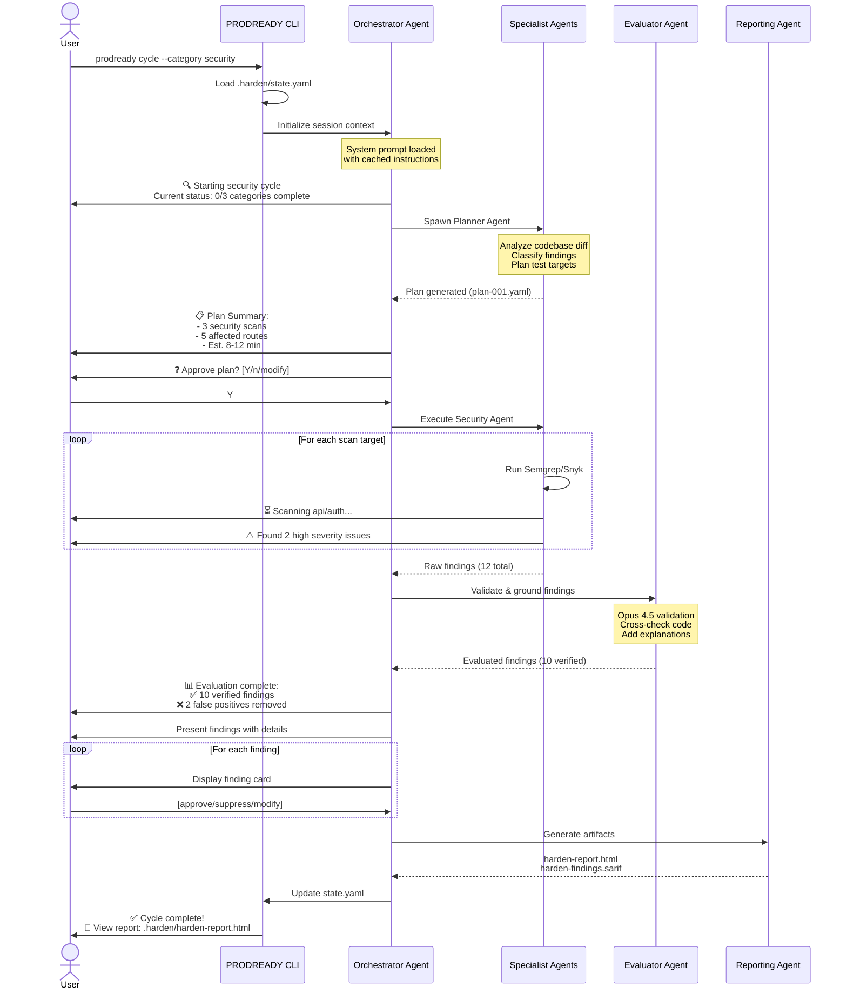

---

## Detailed Cycle Workflow

### 1. Initialization Phase

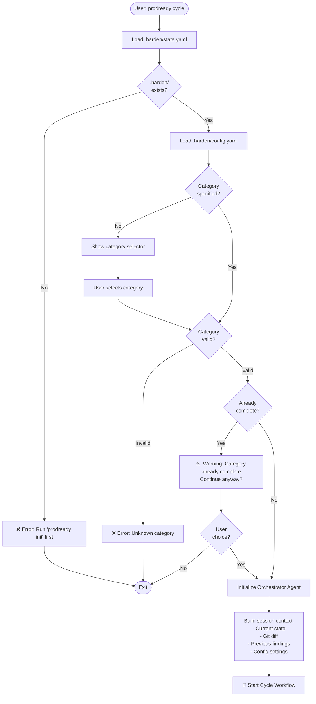

### 2. Planning Phase

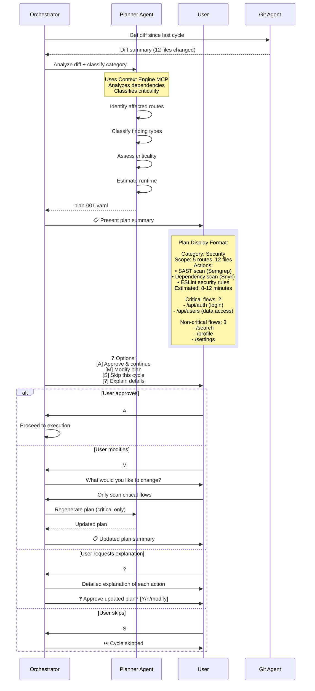

### 3. Execution Phase

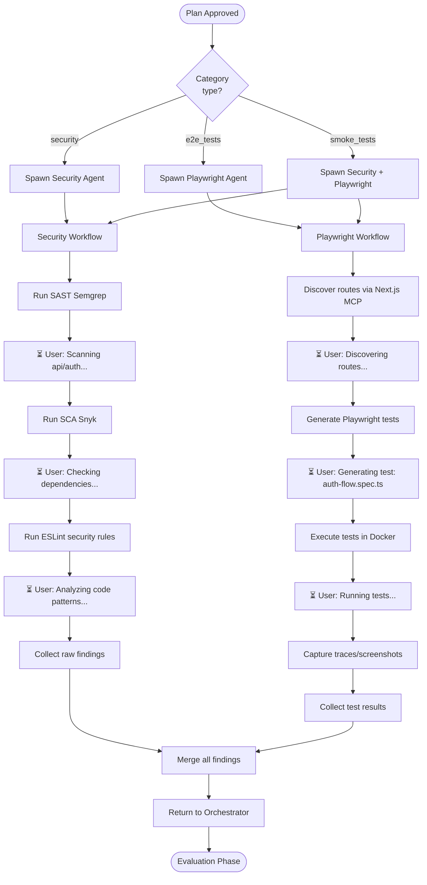

### 4. Evaluation & Approval Phase

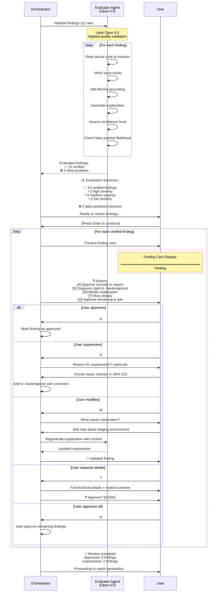

### 5. Reporting Phase

```mermaid
flowchart TD
    Start([Findings Approved]) --> CheckArtifacts{Artifacts<br/>exist?}

    CheckArtifacts -->|First cycle| CreateNew[Create new artifacts]
    CheckArtifacts -->|Subsequent cycle| AppendMode[Append mode]

    CreateNew --> GenHTML[Generate harden-report.html]
    AppendMode --> AppendHTML[Append to harden-report.html]

    GenHTML --> HTMLContent[HTML content includes:<br/>• Executive summary<br/>• Cycle history<br/>• Findings by severity<br/>• Test results<br/>• Evidence links<br/>• Progress charts]

    AppendHTML --> HTMLContent

    HTMLContent --> GenSARIF[Generate/update harden-findings.sarif]

    GenSARIF --> SARIFContent[SARIF content includes:<br/>• Schema v2.1.0<br/>• Tool metadata<br/>• Results array<br/>• Location data<br/>• Severity levels<br/>• CWE/OWASP mapping]

    SARIFContent --> UpdateState[Update .harden/state.yaml]

    UpdateState --> StateChanges[State updates:<br/>• Increment cycle count<br/>• Update category status<br/>• Record findings count<br/>• Update last_cycle_id<br/>• Update timestamps]

    StateChanges --> CreateCycleRecord[Create .harden/cycles/cycle-001.yaml]

    CreateCycleRecord --> CycleData[Cycle record includes:<br/>• Full plan<br/>• Execution log<br/>• Findings IDs<br/>• Approvals<br/>• Model usage<br/>• Cost data<br/>• Cache metrics]

    CycleData --> GitCommit{Auto-commit<br/>enabled?}

    GitCommit -->|Yes| CommitChanges[Git commit:<br/>• Updated artifacts<br/>• State files<br/>• Test files<br/>• Cycle record]

    GitCommit -->|No| Skip[Skip commit]

    CommitChanges --> Display[Display summary to user]
    Skip --> Display

    Display --> ShowSummary[📊 User sees:<br/>━━━━━━━━━━━━━━━━━━━━━━━━<br/>✅ Cycle 1 Complete!<br/>━━━━━━━━━━━━━━━━━━━━━━━━<br/><br/>Category: Security<br/>Status: Complete<br/><br/>Results:<br/>• 8 findings approved<br/>• 2 findings suppressed<br/>• 0 tests generated<br/>• Duration: 9m 23s<br/><br/>Artifacts:<br/>📄 harden-report.html<br/>📄 harden-findings.sarif<br/><br/>Cost: $1.47 USD<br/>Models used:<br/>  • Sonnet 4.5: 3 calls<br/>  • Opus 4.5: 1 call<br/>  • Haiku 4: 2 calls<br/><br/>Next: Run 'prodready status']

    ShowSummary --> End([End Cycle])
```

---

## Agent Communication Patterns

### Orchestrator ↔ Specialist Communication

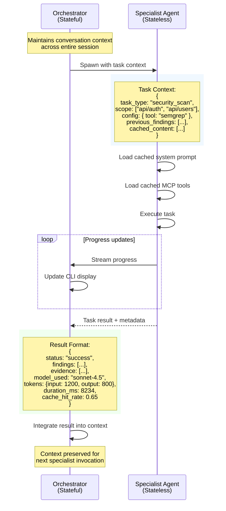

### Prompt Caching Flow

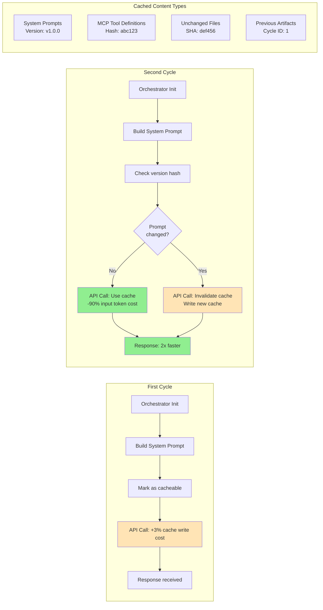

---

## User Approval Gates

### Critical Decision Points

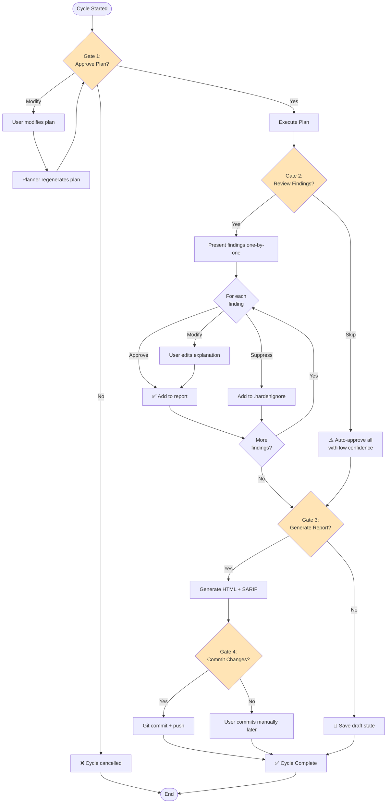

---

## Error Handling & Retry Flow

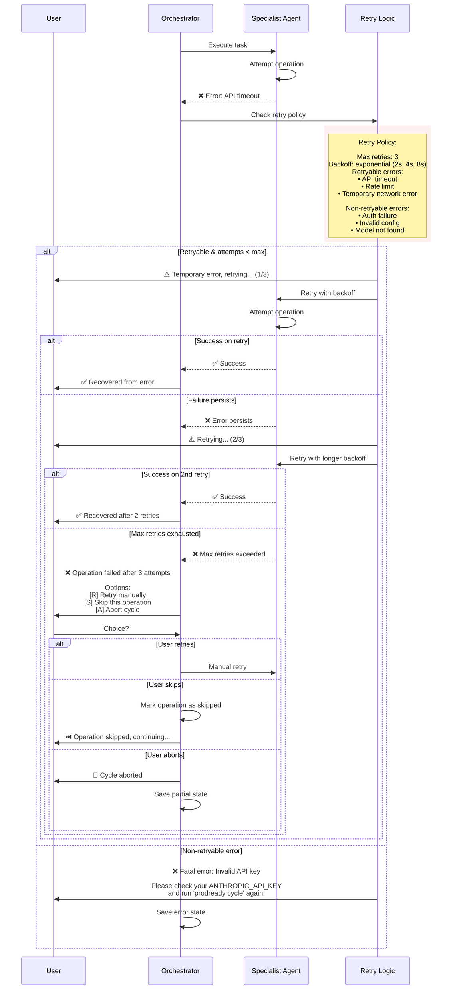

---

## Multi-Cycle Session Flow

### Complete Session from Init to Multiple Cycles

```mermaid
flowchart TD
    Start([New Project]) --> Init[prodready init]

    Init --> CreateStructure[Create .harden/ structure]
    CreateStructure --> CreateBranch[Create hardening branch]
    CreateBranch --> InitState[Initialize state.yaml]

    InitState --> Cycle1Start[prodready cycle --category security]

    Cycle1Start --> C1Plan[Plan security scan]
    C1Plan --> C1Exec[Execute Security Agent]
    C1Exec --> C1Eval[Evaluate findings Opus 4.5]
    C1Eval --> C1Approve[User approves 8 findings]
    C1Approve --> C1Report[Generate artifacts<br/>Cycle 1]
    C1Report --> C1State[Update state:<br/>security: in_progress<br/>last_cycle_id: 1]

    C1State --> Status1[prodready status]
    Status1 --> ShowStatus1[📊 1/3 categories started<br/>8 findings total]

    ShowStatus1 --> Cycle2Start[prodready cycle --category e2e_tests]

    Cycle2Start --> C2Plan[Plan E2E tests]
    C2Plan --> C2Exec[Execute Playwright Agent]
    C2Exec --> C2Tests[Generate 5 tests]
    C2Tests --> C2Run[Run tests: 4 pass, 1 fail]
    C2Run --> C2Eval[Evaluate test quality]
    C2Eval --> C2Approve[User approves tests]
    C2Approve --> C2Report[Append to artifacts<br/>Cycle 2]
    C2Report --> C2State[Update state:<br/>e2e_tests: complete<br/>last_cycle_id: 2]

    C2State --> Cycle3Start[prodready cycle --category security]

    Note1[Re-running security<br/>after code changes]
    Cycle3Start -.->|context| Note1

    Cycle3Start --> C3Diff[Git diff: 3 files changed]
    C3Diff --> C3Plan[Plan incremental scan<br/>Only affected routes]
    C3Plan --> C3Exec[Execute Security Agent<br/>Faster with caching]
    C3Exec --> C3Eval[Evaluate: 2 new findings<br/>6 previous resolved]
    C3Eval --> C3Cross[Cross-reference with Cycle 1]
    C3Cross --> C3Display[Display:<br/>🟢 6 resolved<br/>🔴 2 new<br/>🟡 2 persisting]
    C3Display --> C3Approve[User approves new findings]
    C3Approve --> C3Report[Append to artifacts<br/>Cycle 3]
    C3Report --> C3State[Update state:<br/>security: complete<br/>last_cycle_id: 3]

    C3State --> FinalStatus[prodready status]

    FinalStatus --> ShowFinal[📊 2/3 categories complete<br/>10 total findings<br/>4 E2E tests passing<br/>Ready for production review]

    ShowFinal --> SessionMode[prodready session --max-cycles 5]

    Note2[Session mode:<br/>Auto-run multiple cycles<br/>with checkpoints]
    SessionMode -.->|context| Note2

    SessionMode --> SessionLoop{Cycle<br/>< max?}

    SessionLoop -->|Yes| AutoCycle[Auto-select next category]
    SessionLoop -->|No| SessionDone[Session complete]

    AutoCycle --> CheckCritical{Critical<br/>issues?}

    CheckCritical -->|Yes| HaltSession[🛑 Halt: Critical issue found<br/>Manual review required]
    CheckCritical -->|No| ContinueSession[Continue to next cycle]

    ContinueSession --> SessionLoop

    HaltSession --> ManualReview[User reviews and fixes]
    ManualReview --> SessionLoop

    SessionDone --> FinalReport[Generate final report<br/>All cycles summarized]

    FinalReport --> End([Project Hardened])

    style Cycle1Start fill:#E6F3FF
    style Cycle2Start fill:#E6F3FF
    style Cycle3Start fill:#E6F3FF
    style SessionMode fill:#FFE6F0
```

---

## Prompt Engineering Patterns

### System Prompt Structure (Cached)

```yaml
# Orchestrator Agent System Prompt (Cached)

version: "PRODREADY_v1.0.0"  # Version string for cache invalidation

role: |
  You are the Orchestrator Agent for PRODREADY, an AI-powered SDLC hardening system.
  Your role is to coordinate the complete hardening workflow from planning through reporting.

capabilities:
  - Spawn and coordinate specialist agents
  - Manage user interactions and approvals
  - Maintain state across cycle phases
  - Assemble final artifacts

tools_available:
  - request_approval: Ask user for approval with structured options
  - prompt_user: Ask user a question and wait for response
  - save_state: Persist state to .harden/state.yaml
  - request_override: Request user override for suppression
  - spawn_agent: Invoke a specialist agent with context

workflow_phases:
  1: planning
  2: execution
  3: evaluation
  4: approval
  5: reporting

conversation_style: |
  - Clear, concise status updates
  - Use emojis for visual clarity (✅ ❌ ⏳ 🚨 📊)
  - Stream progress during long operations
  - Always explain what you're doing and why
  - Present options with clear [A/B/C] choices
  - Respect user decisions (never argue)

critical_rules:
  - ALWAYS use Opus 4.5 for Evaluator agent
  - NEVER auto-approve findings without user consent
  - ALWAYS ground findings with file:line references
  - NEVER modify code without user approval
  - ALWAYS respect .hardenignore suppressions
```

### User Prompt Templates

```typescript
// Finding Presentation Template
const findingPrompt = {
  title: "Finding #{index} of {total}",
  severity: "HIGH | MEDIUM | LOW",
  issue: "Brief one-line description",
  location: "file.ts:line",
  code_snippet: "Surrounding code context",
  explanation: "What, where, why in plain language",
  recommendation: "How to fix with code example",
  references: ["CWE-XX", "OWASP Category"],
  confidence: "HIGH | MEDIUM | LOW",
  actions: [
    "[A] Approve (include in report)",
    "[S] Suppress (add to .hardenignore)",
    "[M] Modify explanation",
    "[?] More details",
    "[Q] Approve remaining & quit"
  ]
};

// Approval Request Template
const approvalPrompt = {
  context: "Current phase and what needs approval",
  summary: "Key metrics or decisions to review",
  options: [
    { key: "Y", label: "Yes, proceed", default: true },
    { key: "N", label: "No, cancel" },
    { key: "M", label: "Modify first" }
  ],
  timeout: 300, // 5 minutes before auto-cancel
  allow_empty: false
};

// Progress Stream Template
const progressPrompt = {
  phase: "execution | evaluation | reporting",
  current_task: "Scanning api/auth...",
  progress: "3/10",
  elapsed_time: "2m 15s",
  estimated_remaining: "~6m",
  spinner: true
};
```

---

## State Transitions

### Category Status Lifecycle

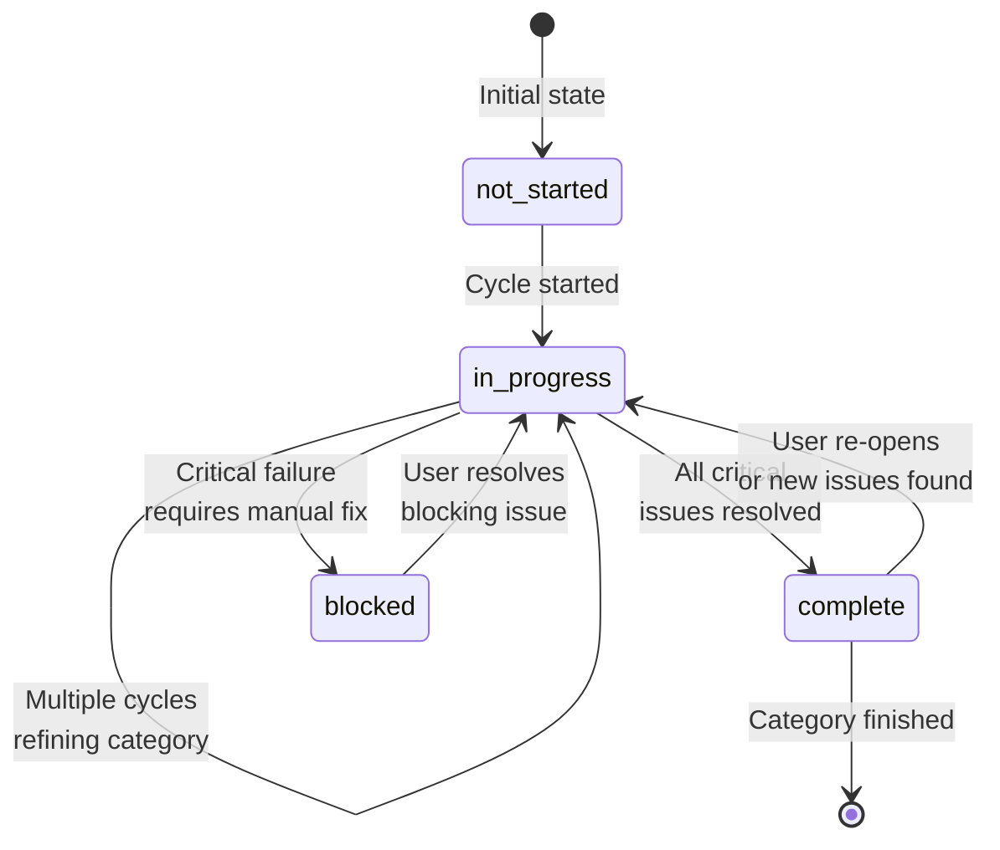

### Finding Status Lifecycle

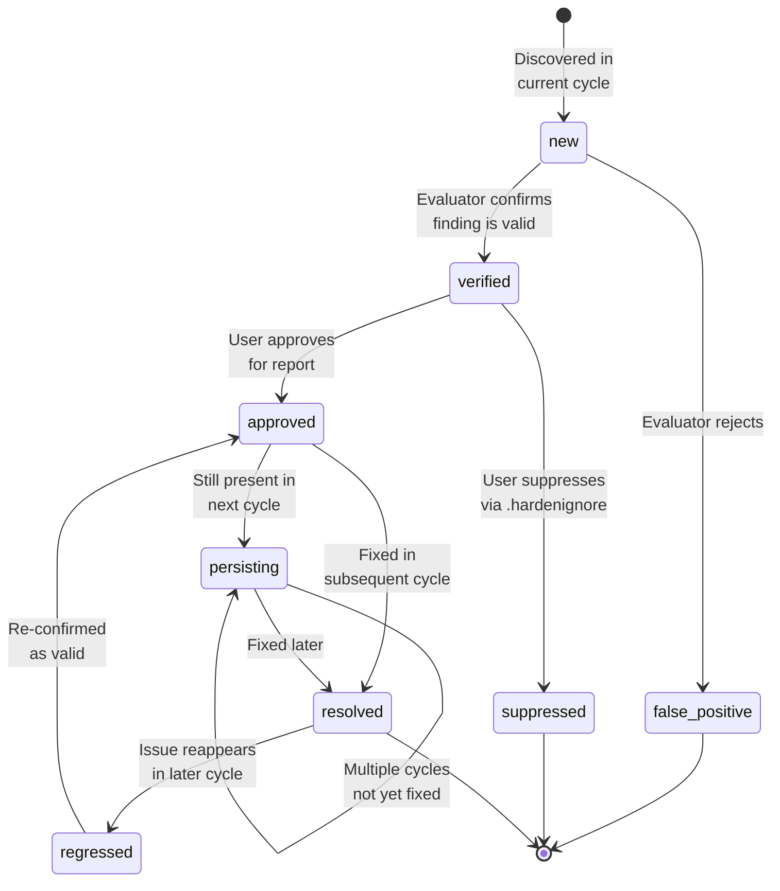

---

## CLI Output Examples

### Terminal Output During Cycle

```
$ prodready cycle --category security

🔍 Initializing PRODREADY...
   ✅ Loaded .harden/state.yaml
   ✅ Current branch: harden/2026-01-16-001
   ✅ Git diff: 12 files changed since last cycle

📋 Planning Phase
   ⏳ Analyzing codebase structure...
   ⏳ Classifying affected routes...
   ✅ Plan generated (8-12 min estimated)

════════════════════════════════════════════════════
Plan Summary - Cycle 2 (Security Category)
════════════════════════════════════════════════════

Scope:
  • 5 routes affected
  • 12 files changed
  • 2 critical flows, 3 non-critical flows

Actions:
  1. SAST scan (Semgrep)
     - Focus: XSS, SQL injection, auth bypasses
     - Rulesets: default, security, typescript

  2. Dependency scan (Snyk)
     - Check: npm packages for known CVEs
     - Target: package.json + lock files

  3. ESLint security rules
     - Rules: no-eval, no-implied-eval, detect-unsafe-regex

Estimated Duration: 8-12 minutes
Estimated Cost: $1.20-$1.80 USD

════════════════════════════════════════════════════

❓ Approve plan and continue? [Y/n/modify/?]
> Y

✅ Plan approved, starting execution...

🔬 Execution Phase
   ⏳ Running SAST scan...
      ⏳ Scanning src/api/auth/route.ts...
      ⚠️  Found 2 high severity issues
      ⏳ Scanning src/components/SearchBar.tsx...
      ⚠️  Found 1 medium severity issue
      ⏳ Scanning src/lib/db.ts...
      ✅ No issues found

   ✅ SAST scan complete (12 findings)

   ⏳ Running dependency scan...
      ⏳ Analyzing package.json...
      ⚠️  Found 3 vulnerabilities (1 high, 2 moderate)

   ✅ Dependency scan complete

   ⏳ Running ESLint security rules...
      ✅ No additional issues found

📊 Evaluation Phase (Opus 4.5)
   ⏳ Validating 15 raw findings...
   ⏳ Cross-checking with actual code...
   ⏳ Adding file:line grounding...
   ⏳ Generating explanations...

   ✅ Evaluation complete!
      ✅ 12 findings verified
      ❌ 3 false positives removed

════════════════════════════════════════════════════
Evaluation Summary
════════════════════════════════════════════════════

✅ 12 verified findings:
   • 3 high severity
   • 5 medium severity
   • 4 low severity

❌ 3 false positives removed:
   • 1: Import statement flagged incorrectly
   • 2: Test file flagged (outside scope)
   • 3: Deprecated but safe API usage

Ready to review findings individually...

════════════════════════════════════════════════════

Press [Enter] to continue
>

════════════════════════════════════════════════════
Finding #1 of 12
════════════════════════════════════════════════════

🚨 HIGH SEVERITY

Issue: Cross-Site Scripting (XSS) vulnerability
Location: src/components/SearchBar.tsx:42

Code:
  40 | export function SearchBar({ onSearch }) {
  41 |   const searchQuery = req.query.q;
  42 |   return <div>{searchQuery}</div>;  // ← Unsafe
  43 | }

Explanation:
User input from query parameter 'q' is directly rendered
without sanitization, allowing potential XSS attacks.

An attacker could craft a URL like:
  /search?q=<script>alert('XSS')</script>

The script would execute in the user's browser.

Recommendation:
Use DOMPurify or escape user input before rendering:

  import DOMPurify from 'dompurify';
  const sanitized = DOMPurify.sanitize(searchQuery);
  return <div>{sanitized}</div>;

Or use textContent instead of innerHTML.

References:
  • CWE-79: Cross-site Scripting
  • OWASP A7:2017-XSS

Confidence: HIGH
False Positive Likelihood: LOW

════════════════════════════════════════════════════

❓ Actions:
   [A] Approve (include in report)
   [S] Suppress (add to .hardenignore)
   [M] Modify explanation
   [?] More details
   [Q] Approve remaining & quit
>

[... continues for each finding ...]

✅ Review complete!
   Approved: 10 findings
   Suppressed: 2 findings

📄 Generating Reports
   ⏳ Appending to harden-report.html...
   ⏳ Updating harden-findings.sarif...
   ✅ Artifacts generated

💾 Updating State
   ✅ .harden/state.yaml updated
   ✅ .harden/cycles/cycle-002.yaml created

════════════════════════════════════════════════════
✅ Cycle 2 Complete!
════════════════════════════════════════════════════

Category: Security
Status: Complete

Results:
  • 10 findings approved
  • 2 findings suppressed
  • 0 tests generated
  • Duration: 9m 23s

Artifacts:
  📄 .harden/harden-report.html
  📄 .harden/harden-findings.sarif

Cost: $1.47 USD
Models used:
  • Sonnet 4.5: 3 calls (planning, execution, reporting)
  • Opus 4.5: 1 call (evaluation)
  • Haiku 4: 2 calls (git operations, SARIF formatting)

Cache Performance:
  • Hit rate: 62%
  • Savings: $0.85 (47% vs no cache)
  • Latency improvement: 1.8x

════════════════════════════════════════════════════

Next Steps:
  • View report: .harden/harden-report.html
  • Check status: prodready status
  • Continue: prodready cycle --category e2e_tests

```

---

## Maintenance Notes

**This document should be updated when:**

1. New agents are added to the system
2. User interaction patterns change
3. Approval gates are modified
4. CLI output format changes
5. Error handling logic is updated
6. New prompt engineering patterns emerge
7. State management schema changes

**Update History:**
- 2026-01-16: Initial version (Phase 0 complete)

**Related Documents:**
- [PRODREADY_ARCHITECTURE.md](../../docs/PRODREADY_ARCHITECTURE.md)
- [MULTI_MODEL_ROUTING_STRATEGY.md](../../docs/MULTI_MODEL_ROUTING_STRATEGY.md)
- [PROMPT_CACHING_STRATEGY.md](../../docs/PROMPT_CACHING_STRATEGY.md)
- [START_HERE_IMPLEMENTATION.md](../../docs/START_HERE_IMPLEMENTATION.md)
